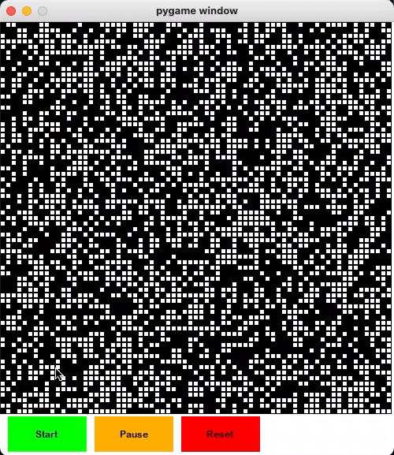
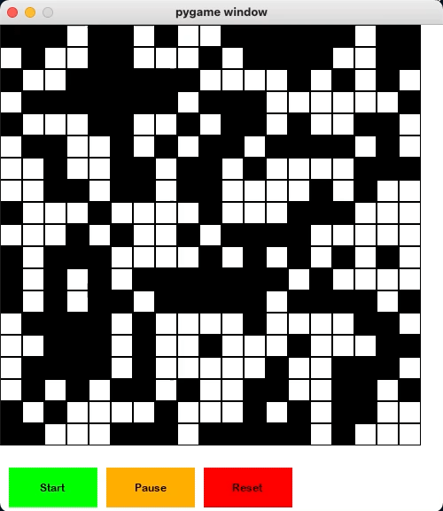

# Pathfinding Algorithm Visualizer
A visualization of various pathfinding algorithms including A*, Breadth-first-search, and Dijkstra's Algorithm.

## Running the program.
After downloading the project, run the following commands in your terminal: 

`cd path_finder_algorithm_visualization-master/code`  
`pip3 install pygame`  
`python3 main.py`

You will see further instructions displayed in your terminal on how to run the visualizer. Enjoy!

## Interacting with the visualizer

<ol>
<li>Click on any box in the grid to toggle its status of being a wall (a type of box that cannot be moved through).</li>
<li>Right-click to make a box the starting/entry point of the pathfinding algorithm.</li>
<li>Shift + right-click a box to make it the end point of the search.</li>
<li>Click the button labelled as "START" to run the algorithm.</li>
</ol> 

### Examples

Running the command "**python3 main.py 70 a_star 1**"

Running the command "**python3 main.py 20 bfs_weighted 1**"

 
