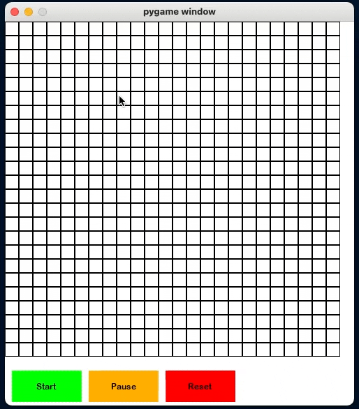
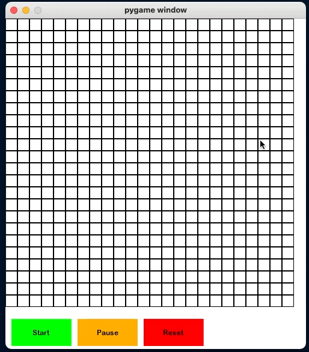

# Pathfinding Algorithm Visualizer
A visualization of various pathfinding algorithms including A*, Dijkstra's Algorithm,  and Breadth-first-search.


## Running the program.
After cloning the project onto your local computer, run the following commands in your terminal: 

`cd path_finder_algorithm_visualization-master/code` <br/>
`pip3 install pygame` <br/>
`python3 main.py`

You will see further instructions displayed in your terminal on how to run the visualizer. Enjoy! \
*please note that this was made with python3.8 so the pygame window may look a little different depending on what other python version you use.*

## Interacting with the visualizer

<ol>
<li>Click on any box in the grid to toggle its status of being a wall (a type of box that cannot be moved through).</li>
<li>Right-click to make a box the starting/entry point of the pathfinding algorithm.</li>
<li>Shift + right-click a box to make it the end point of the search.</li>
<li>Click the button labelled as "START" to run the algorithm.</li>
</ol> 


## Examples
A quick note about the meaning of all the colors you see:
 - purple: boxes of this color make up the shortest path from the starting point (green box) to the end/destination (red box).
 - yellow: boxes of this color have been encountered, but not yet fully explored by the algorithm.
 - blue: boxes of this color have been fully explored by the algorithm.


```bash
python3 main.py 70 a_star 1
```


```bash
python3.8 main.py 50 dij 1
```


```bash
python3.8 main.py 25 a_star 1
```



```bash
python3.8 main.py 25 dij 1
```



 
